# WheelRiot

## Project Overview

WheelRiot is a full-stack e-commerce platform built to manage the complete online shopping lifecycle. Engineered as a monorepo, it bridges user-facing digital retail interfaces with robust backend administrative and logistical operations. The application automates critical business flows including payment verification, invoice generation, and shipping calculations.

## Highlights

- Full Stack E-Commerce Platform
- Google OAuth Authentication
- Razorpay Payment Integration
- ShipRocket Logistics Integration
- Role-Based Admin Dashboard
- Invoice Generation & Email Automation
- Self-Hosted Deployment using PM2 and Cloudflare Tunnel

## Key Features

**User Experience & Authentication**

* Secure authentication using standard Email/Password (JWT + bcrypt) and Google OAuth integration.
* Role-Based Access Control (RBAC) separating Standard Users and Admins.
* Persistent shopping cart and customizable wishlist (favorites).
* Address book management with support for multiple addresses and default selections.
* Detailed order tracking and historical order viewing.

**Checkout & Logistics Integration**

* Integrated Razorpay gateway for secure, verified prepaid transactions.
* Cash on Delivery (COD) workflow support.
* ShipRocket API integration for live pincode serviceability checks.
* Automated Adhoc dispatch order creation and return label generation.
* Dynamic coupon system with automated discount application.

**Administrative Operations**

* Dedicated secure Admin Dashboard for platform management.
* Real-time system analytics, traffic logging, and sales monitoring.
* Full CRUD capabilities for Products, Brands, Coupons, and User Reviews.
* Order pipeline management interface to transition statuses (e.g., packing, shipped, RTO).
* Dynamic platform settings configuration (API keys, operational toggles) injected directly via the database.
* Automated transactional email notifications and PDF invoice generation.

## Tech Stack

**Frontend**

* React
* Vite
* Tailwind CSS
* Zustand (Global state management)
* Framer Motion & GSAP (Animation and route transitions)
* Recharts (Dashboard analytics)

**Backend**

* Node.js & Express.js
* MongoDB (Mongoose ODM)
* JWT & `@react-oauth/google` / `google-auth-library` (Authentication)
* Nodemailer (Email dispatch)
* PDFKit (Document generation)

**Third-Party Services**

* Razorpay API (Payments)
* ShipRocket API (Logistics)
* Discord Webhooks (System logging)

## Architecture Overview

The application follows a decoupled client-server architecture housed within a monorepo.

* **Frontend**: A React SPA that utilizes route-level code splitting to optimize bundle size. Global state (like the shopping cart) is managed via Zustand to prevent prop-drilling, while local state handles UI interactions.
* **Backend**: An Express.js REST API structured around the MVC pattern. Route controllers delegate complex external interactions to dedicated service classes (`RazorpayService`, `ShipRocketService`).
* **Database**: MongoDB utilized with Mongoose. Schemas employ compound indexing to optimize high-frequency read operations for the admin dashboard.

## Project Structure

```text
wheelriot/
├── client/                 # React SPA
│   ├── public/
│   ├── src/
│   │   ├── components/     # Reusable UI elements
│   │   ├── context/        # React context providers
│   │   ├── layouts/        # Route layouts (Main, Admin)
│   │   ├── pages/          # View components
│   │   └── store/          # Zustand global state
│   ├── package.json
│   └── vite.config.js
├── screenshots/            
├── server/                 # Express API
│   ├── middleware/         # Auth, traffic, and security middleware
│   ├── models/             # Mongoose schemas
│   ├── routes/             # API endpoint definitions
│   ├── services/           # External API wrappers
│   ├── utils/              # Helper functions (logger, PDF generator)
│   ├── index.js            # Entry point
│   └── package.json
├── README.md
├── package.json            # Monorepo root configuration
└── ecosystem.config.js     # PM2 deployment configuration

```

## Installation

1. Clone the repository:
```bash
git clone https://github.com/yourusername/wheelriot.git
cd wheelriot

```


2. Install dependencies for both client and server:
```bash
npm run install:all

```


3. Set up environment variables (see section below).
4. Start the development servers concurrently:
```bash
npm start

```


## Environment Variables

Create a `.env` file in both the `client` and `server` directories based on the provided `.env.example` files.

**Client (`client/.env`)**

```env
VITE_API_URL=http://localhost:5000
VITE_GOOGLE_CLIENT_ID=your_google_oauth_client_id

```

**Server (`server/.env`)**

```env
PORT=5000
MONGO_URI=mongodb://127.0.0.1:27017/hooligan
JWT_SECRET=your_secure_jwt_secret
NODE_ENV=development
GOOGLE_CLIENT_ID=your_google_oauth_client_id
NODEMAILER_EMAIL=your_email@domain.com
NODEMAILER_PASSWORD=your_app_password
RAZORPAY_KEY_ID=your_razorpay_key
RAZORPAY_KEY_SECRET=your_razorpay_secret
SHIPROCKET_EMAIL=your_shiprocket_email
SHIPROCKET_PASSWORD=your_shiprocket_password

```

## Deployment Architecture

WheelRiot is self-hosted on a personal Ubuntu home server. Node.js backend processes are managed using PM2 for process monitoring, automatic restarts, and service persistence. External web traffic is securely routed to the local server environments using Cloudflare Tunnels, which handles DNS resolution and SSL termination without requiring traditional cloud hosting providers or exposed public IP addresses.

## Security Features

* **Data Sanitization**: Aggressive mitigation of NoSQL injection and Cross-Site Scripting (XSS) using `express-mongo-sanitize` and `xss-clean`.
* **Rate Limiting**: API endpoints are protected by `express-rate-limit` to prevent brute-force attacks and abuse.
* **Header Protection**: Implementation of `helmet` for secure HTTP headers, including strict Content Security Policies (CSP) configured for Google and Razorpay iframes.
* **Parameter Pollution**: Prevention of HTTP Parameter Pollution using `hpp`.
* **Payload Limits**: Strict JSON payload limits (1mb) to prevent denial-of-service via massive requests.
* **Cryptographic Verification**: Webhook payloads and payment callbacks are verified using SHA256 HMAC signatures.

## Screenshots

### Landing

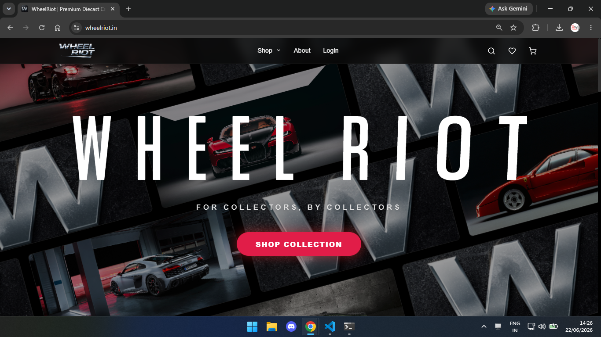

### Featured Section

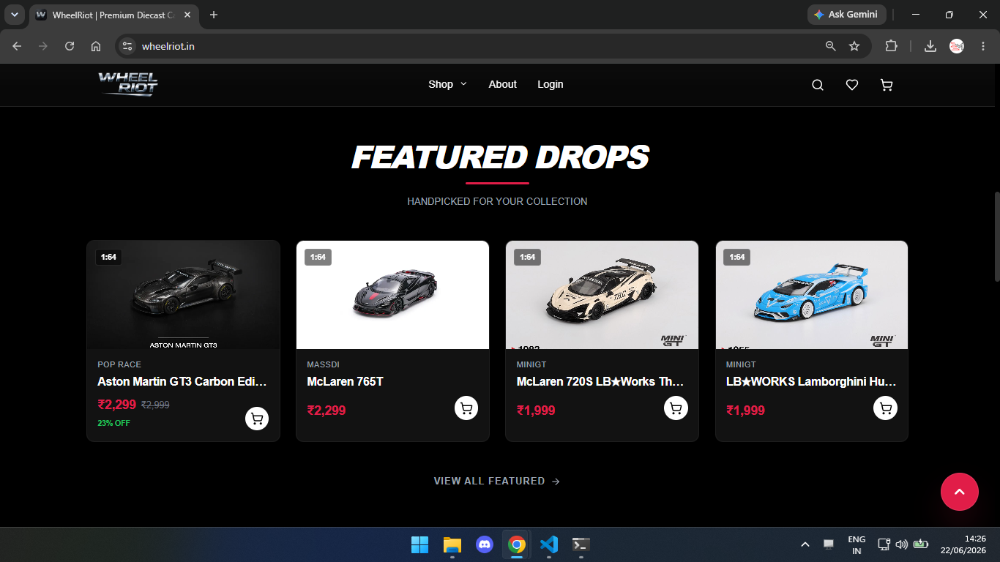

### Shop

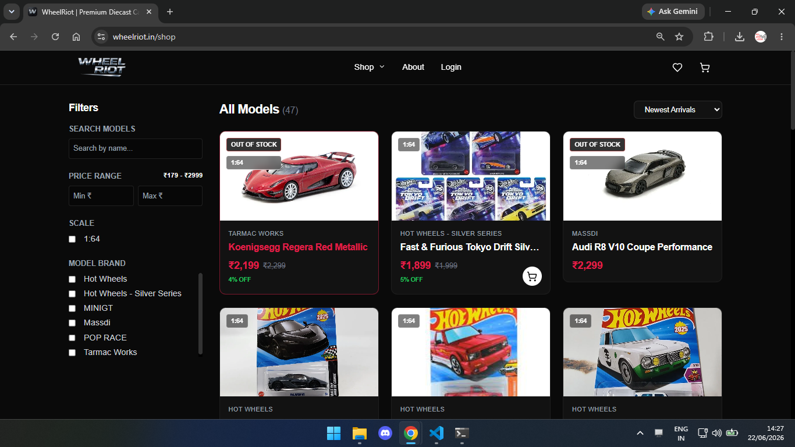

### Product

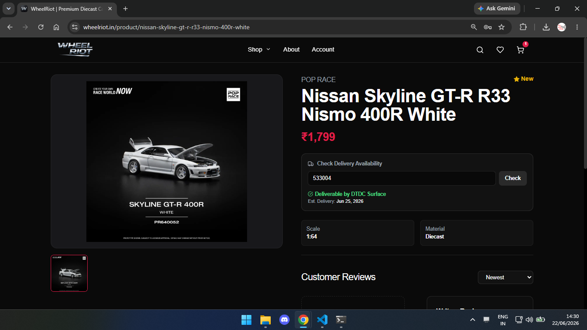

### Checkout

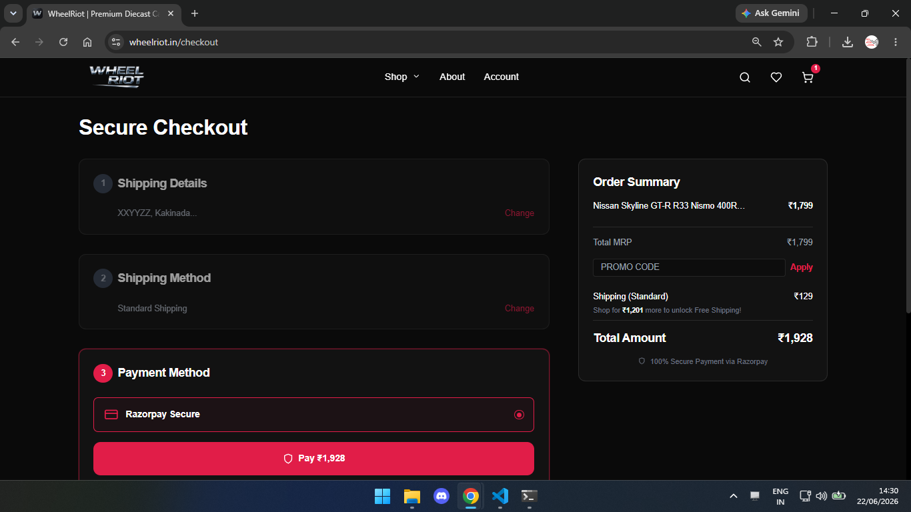

### About

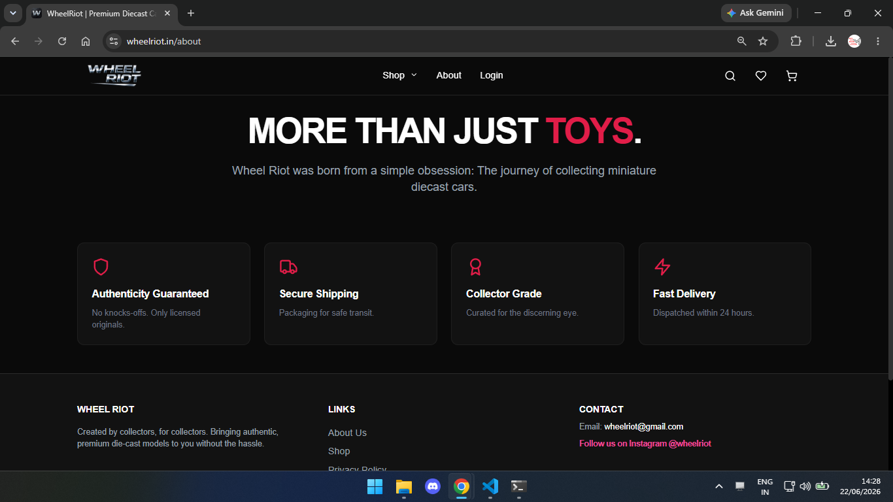

### Admin Dashboard

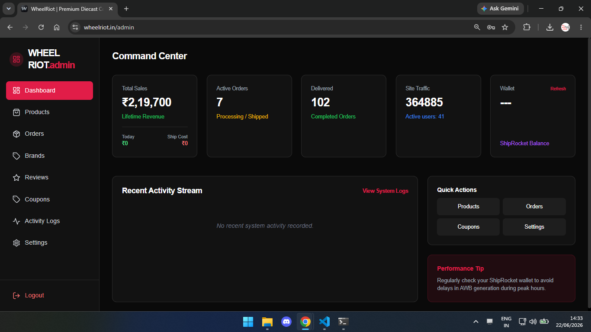

### Admin Orders Page

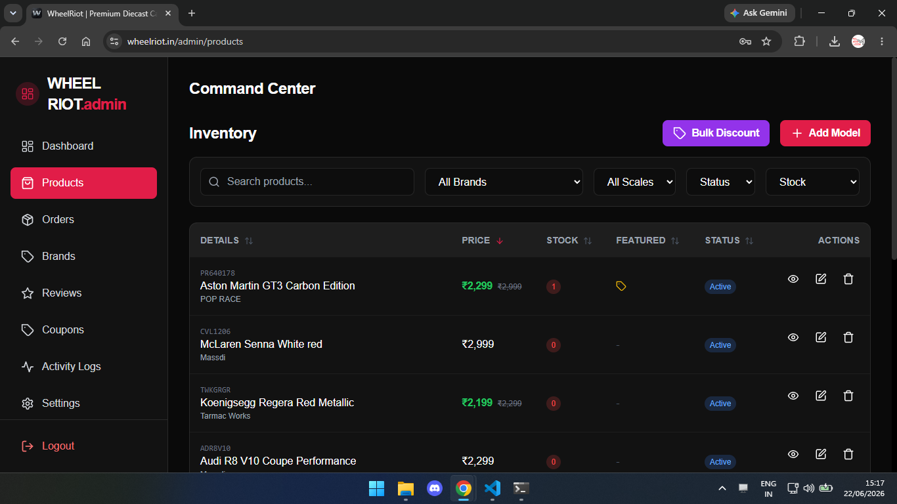

### Order Info

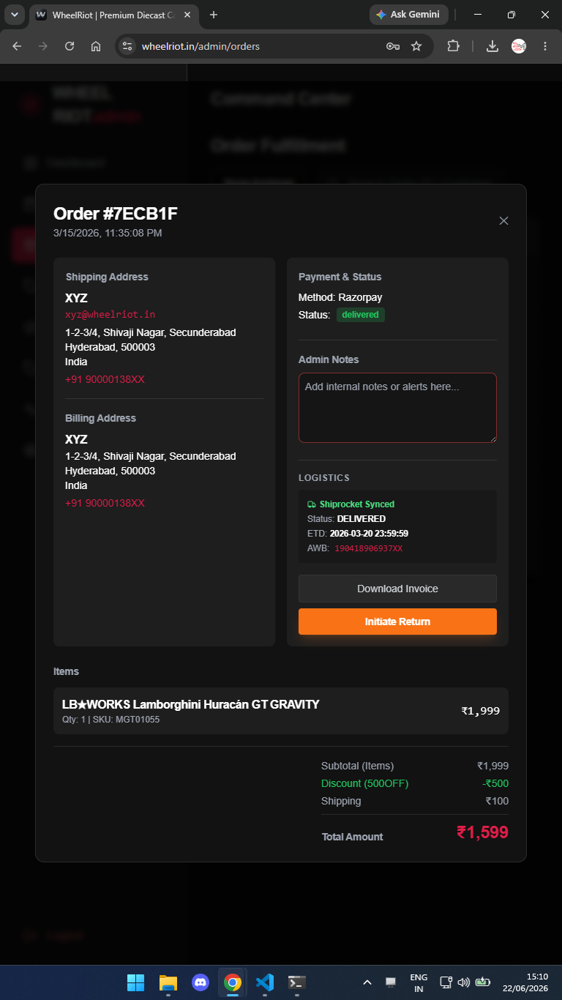

### Admin Logs

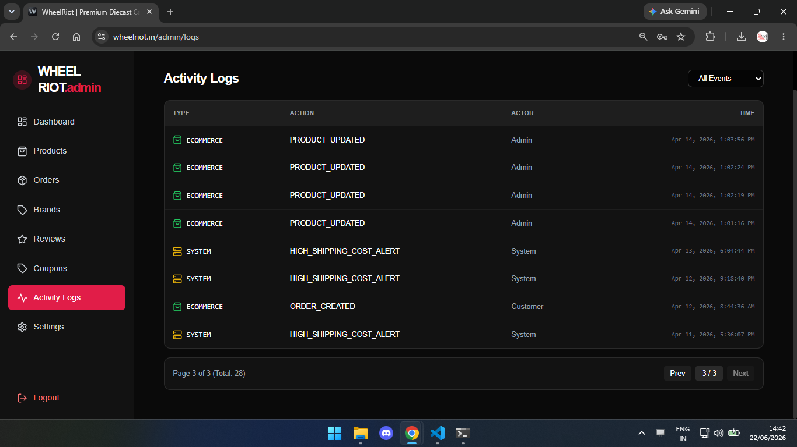

### Admin Settings

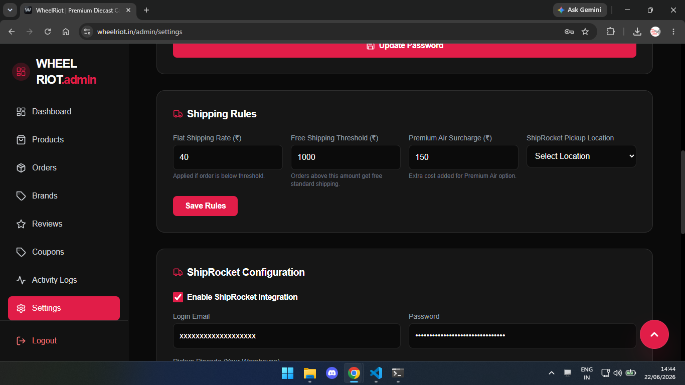

## Author

**Sandeep Reddy**

Computer Science Student, Aditya University

Portfolio: [sandyy.in](https://sandyy.in)

GitHub: [Sandeep-Reddy-18](https://github.com/Sandeep-Reddy-18)

LinkedIn: [sandeep-reddy-manda](https://linkedin.com/in/sandeep-reddy-manda)
